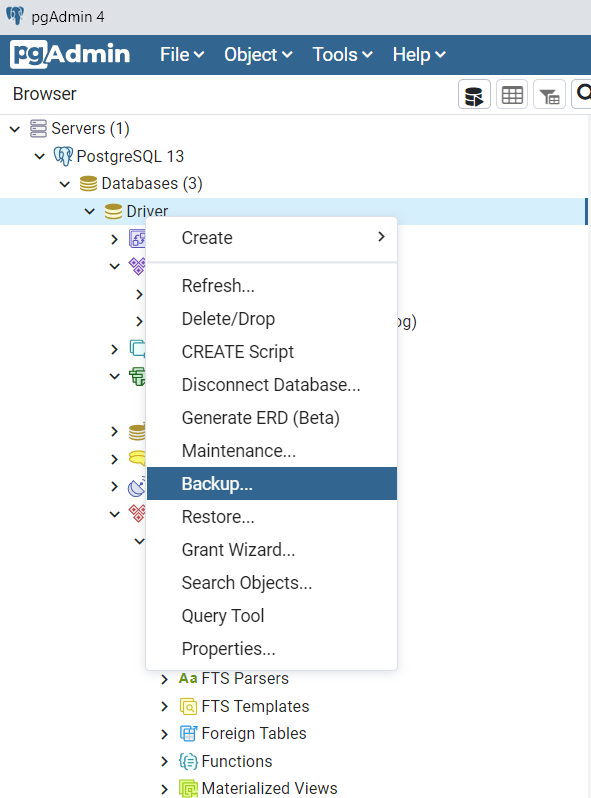
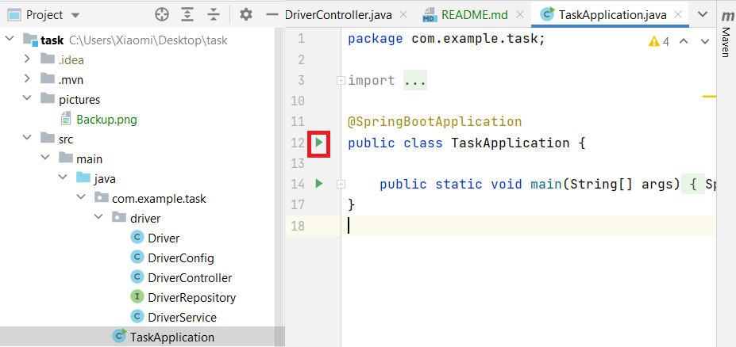
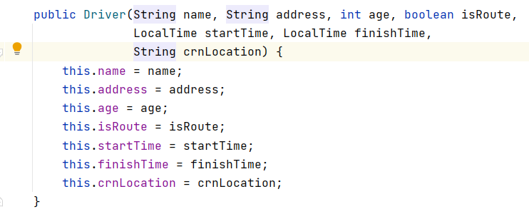
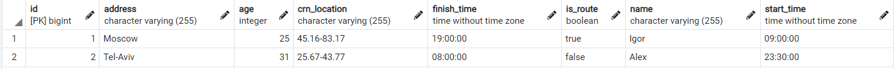
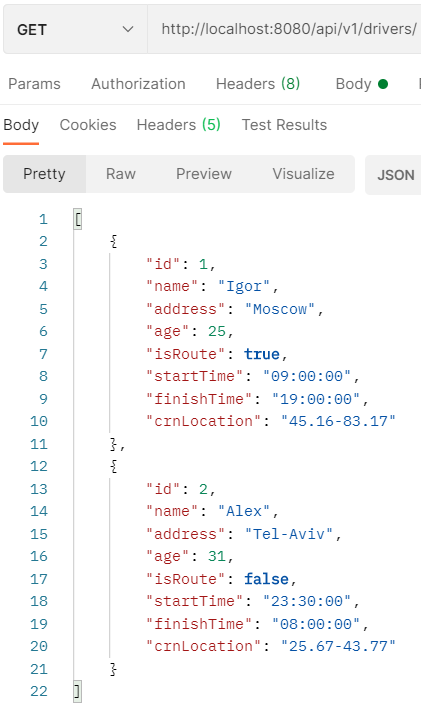

# Microservice for drivers management
Drivers microservice service responsibility is to store, maintain and query driver’s data.

## Driver domain:
A driver model store the following data: personal information (such as name, age,
address), driver status, working hours and current location.

## Endpoints:
* The microservice expose CRUD endpoints in a RESTful way and respond with JSON format.
* The microservice expose a query endpoints with the ability to query all drivers, active drivers and drivers that working in a present time.

## Tools:
* Backend: Java 11/Spring
* DB: PostgreSQL

## Installation:
Create a table at PostgreSQL with the name "Driver" 
and to do Restore file "driversDB".

After that, you can run application:
path:task/src/main/java/com.example.task/TaskApplication.java

You launch the server: http://localhost:8080, port 5432 

## Information about work:
A driver model store the following data: personal information (such as name, age,
address), driver status, working hours and current location.

### DateBase:

### Requests:
#### GET: 
* http://localhost:8080/api/v1/drivers - It's method for getting all drivers;
* http://localhost:8080/api/v1/drivers/onRoute - It's method for getting all drivers, who has isRoute = true;
* http://localhost:8080/api/v1/drivers/onTime - It's method for getting all drivers, who work now.

#### POST:
http://localhost:8080/api/v1/drivers/add - It's method for adding new driver.

#### DELETE:
http://localhost:8080/api/v1/drivers/delete/{driverId} - It's method for deleting driver.

{driverId} - Id driver.

#### PUT:
http://localhost:8080/api/v1/drivers/change/{driverId}?isRoute=...&startTime=...&finishTime=... - It's method for change some information about the driver.

Information for change: driver status, working hours.

## Example
### GET Request

                                                                                                                        

